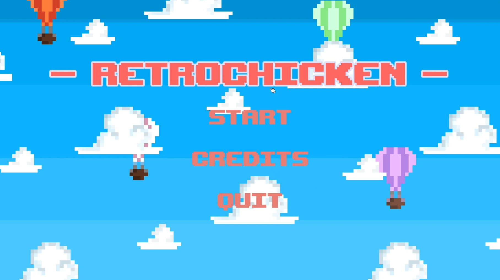
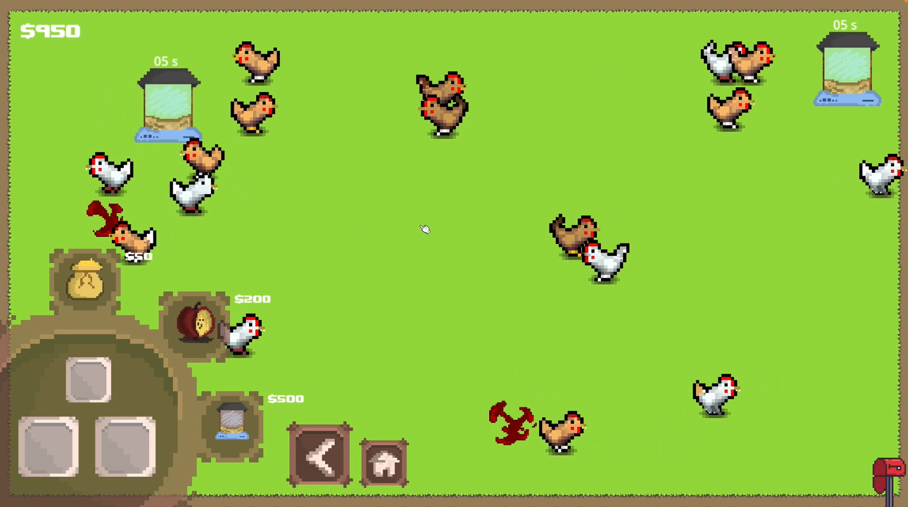

# RetroChicken Prototype / CGRA252

## Game Description
### Synopsis
You are a disgraced biologist who’s lost their funding - and maybe their career! - due to the dearth of ethics and excess of lies displayed in your recent academic paper. In order to redeem yourself, you need to provide evidence that you’ve successfully backbred chickens into microraptors - nay, call them RetroChickens™. 

You have an ever-growing backyard chicken pen and as much chicken feed as you can buy on your remaining budget. As so many famously ethical scientists say, you’ve got to crack a few hundred eggs to make a… microraptor? (Excuse me, RetroChicken™). 

Anyway, get cracking!

### To play
Download the zip found [here](https://github.com/DrerAhv/RetroChicken/releases/tag/1.0.0), unzip it, then run RetroChicken.exe.

### Controls

This is a 'clicker game'. You're going to be using that left mouse button.

**To breed:** Click on the arrow at the bottom of the screen to open the menu, and then click on chickens to create an Egg. Click on the button with the Egg in it and bring it over to the Incubator and click on the Incubator to drop it in. A new chicken will pop out in five seconds, having inherited a mix of traits from both parents (and maybe even mutated a few new ones!)

**To sell eggs**: When you've bred two chickens, click on the Egg button and bring the egg over to the Mailbox in the lower right corner, then click on the mailbox to sell the egg. 

**To buy items:** Open the menu, then click on the item you'd like to buy and click anywhere on the map to place it. Notice your remaining money in the upper left corner - if this drops too low, you won't be able to buy anything! If you'd like to cancel your purchase, hit the Escape or Delete button before you click to place the item.

### Credits
- Evie Melhuish: Artist, coder 
- Alex Welsby (@DrerAhv): Coder
- Timothy Green: Coder
- Olivia Beauchamp: Coder

### Assets used:
- [PixelPlant's Free Animated Chicken Sprite Sheet and Gifs](https://pixelplant.itch.io/chicken-sprite-sheet)
- [Schwarnhild's Basic Tileset and Asset Pack 32x32 Pixels](https://schwarnhild.itch.io/basic-tileset-and-asset-pack-32x32-pixels?download)
- [pixyfantasystudios' Mailbox](https://pixyfantasystudios.itch.io/mailbox) 
- [Virusystem's Blood Splatter](https://virusystem.itch.io/blood-explosion)
